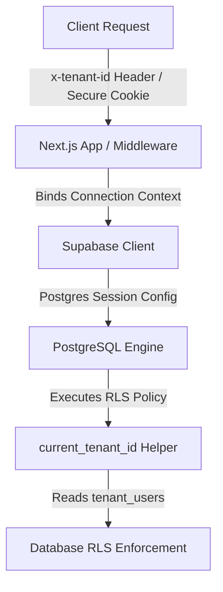

# Enterprise-Grade Authentication & Authorization Architecture (V2 Specification)

This specification outlines the architecture, database schema, Row-Level Security (RLS) enforcement patterns, and request life-cycle for the planned enterprise-grade authorization and authentication system at **Mealiez**.

---

## Executive Summary

The legacy authorization architecture in Mealiez relied on **JWT-embedded claims** (`auth.jwt() -> 'app_metadata' -> 'tenant_id'`). While simple and performant for single-tenant users, it introduced critical limitations:
1. **No Multi-Tenant Support**: A single authenticated user could not belong to multiple tenants because their `tenant_id` was hardcoded inside their identity token.
2. **Stale Claims**: Role modifications or account suspensions required signing the user out and forcing token re-issuance to refresh JWT claims.
3. **JWT Size Inflation**: Appending granular permissions to the token caused bloated HTTP headers.

The **Enterprise Architecture (V2)** completely decouples **Identity** (managed by Supabase Auth) from **Authorization** (managed by public database tables). By resolving authorization context on a per-request basis through database junction tables, Mealiez achieves instant role updates, true multi-tenant memberships, granular capabilities, and full audit logs.

---

## Core Architectural Pillars



### 1. Database-Driven Membership & RBAC
Identity is verified via standard auth mechanisms, but tenant membership is verified by querying a junction table in the public schema. 

*   **`public.tenant_users`**: A junction table mapping an `auth.users` ID to a `public.tenants` ID, specifying the active role (`admin`, `manager', `member`) and membership status (`is_active`).
*   **`public.platform_admins`**: A separate, isolated global lookup table designating platform administrators (superadmins) who bypass single-tenant limits to execute platform-wide actions.

### 2. Request-Scoped Tenant Context
Because a user can be a member of multiple tenants, they must select an **active tenant context** for their current session.
*   **Context Transmission**: The client sends the active tenant ID in the request headers (`x-tenant-id`) or stores it in a secure, encrypted session cookie (`mealiez_current_tenant_id`).
*   **Connection Setting Binding**: When the backend instantiates the Supabase client, it runs the `set_tenant_context(uuid)` RPC or passes the header to PostgREST. PostgREST maps the `x-tenant-id` header to a local transaction setting: `current_setting('app.current_tenant_id')`.
*   **RLS Security Boundary**: The database isolates rows based on this connection setting, which is verified against `public.tenant_users` to prevent spoofing or lateral escalations.

### 3. Granular Capabilities over Roles
In V2, the frontend and API do not check raw strings (e.g. `role === 'admin'`). Instead, they evaluate **Permissions**.
*   **Role-to-Permission Mapping**: Standardized roles have pre-mapped capabilities (e.g., `recipes.create`, `inventory.order`, `users.invite`, `billing.manage`).
*   **Dynamic Enforcement**: Changing permissions for a role automatically updates capabilities system-wide without modifying schema or redeploying code.

---

## Database Schema Specification

### Tenant Memberships
```sql
CREATE TABLE public.tenant_users (
  id uuid PRIMARY KEY DEFAULT gen_random_uuid(),
  tenant_id uuid NOT NULL REFERENCES public.tenants(id) ON DELETE CASCADE,
  user_id uuid NOT NULL REFERENCES auth.users(id) ON DELETE CASCADE,
  role text NOT NULL CHECK (role IN ('admin', 'manager', 'member')),
  is_active boolean NOT NULL DEFAULT true,
  created_at timestamptz DEFAULT now(),
  UNIQUE (tenant_id, user_id)
);

CREATE INDEX idx_tenant_users_user_tenant ON public.tenant_users(user_id, tenant_id);
```

### Platform Superadmins
```sql
CREATE TABLE public.platform_admins (
  user_id uuid PRIMARY KEY REFERENCES auth.users(id) ON DELETE CASCADE,
  created_at timestamptz DEFAULT now()
);
```

### Compliance Audit Logging
```sql
CREATE TABLE public.audit_logs (
  id uuid PRIMARY KEY DEFAULT gen_random_uuid(),
  tenant_id uuid REFERENCES public.tenants(id) ON DELETE CASCADE,
  user_id uuid REFERENCES auth.users(id) ON DELETE SET NULL,
  action text NOT NULL,
  entity_type text NOT NULL,
  entity_id uuid,
  details jsonb DEFAULT '{}'::jsonb,
  ip_address text,
  user_agent text,
  created_at timestamptz DEFAULT now()
);
```

---

## SQL RLS & Context Helpers

### Context Resolution Helper
The core engine function `public.current_tenant_id()` extracts the active tenant context safely by reading either transaction local settings (for RPCs) or PostgREST request headers (for client queries):

```sql
CREATE OR REPLACE FUNCTION public.current_tenant_id()
RETURNS uuid
LANGUAGE sql
STABLE
SECURITY DEFINER
AS $$
  SELECT COALESCE(
    NULLIF(current_setting('app.current_tenant_id', true), ''),
    NULLIF(current_setting('request.headers', true)::json->>'x-tenant-id', '')
  )::uuid;
$$;
```

### Context Switcher RPC
To change the active context during a session, the backend invokes `public.set_tenant_context(uuid)`. It validates membership prior to setting the session variable, blocking lateral tenant jumping.

```sql
CREATE OR REPLACE FUNCTION public.set_tenant_context(p_tenant_id uuid)
RETURNS void
LANGUAGE plpgsql
SECURITY DEFINER
SET search_path = public
AS $$
BEGIN
  -- Verify membership
  IF NOT EXISTS (
    SELECT 1 FROM public.tenant_users 
    WHERE user_id = auth.uid() 
      AND tenant_id = p_tenant_id 
      AND is_active = true
  ) THEN
    -- Fallback check for Platform Admins
    IF NOT EXISTS (SELECT 1 FROM public.platform_admins WHERE user_id = auth.uid()) THEN
      RAISE EXCEPTION 'Unauthorized tenant access';
    END IF;
  END IF;

  PERFORM set_config('app.current_tenant_id', p_tenant_id::text, false);
END;
$$;
```

---

## RLS Enforcement Patterns

Standard multi-tenant tables utilize clean, high-performance RLS filters bypassing costly multi-table joins.

```sql
-- Standard Select Filter Pattern
CREATE POLICY "tenant_select_isolation" 
ON public.inventory_items FOR SELECT
USING (tenant_id = public.current_tenant_id());

-- Standard Write/Mutate Filter Pattern
CREATE POLICY "tenant_write_isolation" 
ON public.inventory_items FOR ALL
USING (tenant_id = public.current_tenant_id())
WITH CHECK (
  tenant_id = public.current_tenant_id() 
  AND public.get_user_role() IN ('admin', 'manager')
);
```

---

## Step-by-Step Rollback Playbook (To Legacy V1)

If the active phase calls for a revert to the **Legacy V1 (JWT-embedded / App Metadata-driven)** architecture, execute the following playbook. This completely strips the V2 enterprise schema and restores V1 helpers and policies.

### Rollback SQL Script

Run the following SQL block in the database console (e.g., Supabase SQL Editor) to perform a clean rollback:

```sql
-- 1. Drop V2 tables and functions
DROP TABLE IF EXISTS public.audit_logs CASCADE;
DROP TABLE IF EXISTS public.tenant_users CASCADE;
DROP TABLE IF EXISTS public.platform_admins CASCADE;
DROP FUNCTION IF EXISTS public.set_tenant_context(uuid) CASCADE;
DROP FUNCTION IF EXISTS public.current_tenant_id() CASCADE;

-- 2. Restore V1 legacy token helper: get_tenant_id()
CREATE OR REPLACE FUNCTION public.get_tenant_id()
RETURNS uuid
LANGUAGE sql
STABLE
AS $$
  SELECT COALESCE(
    (auth.jwt() -> 'app_metadata' ->> 'tenant_id'),
    (auth.jwt() -> 'user_metadata' ->> 'tenant_id'),
    (auth.jwt() ->> 'tenant_id')
  )::uuid
$$;

-- 3. Restore V1 legacy token helper: get_user_role()
CREATE OR REPLACE FUNCTION public.get_user_role()
RETURNS text
LANGUAGE sql
STABLE
AS $$
  SELECT COALESCE(
    (auth.jwt() -> 'app_metadata' ->> 'role'),
    (auth.jwt() -> 'user_metadata' ->> 'role'),
    (auth.jwt() ->> 'role'),
    'member'
  )::text
$$;

-- 4. Drop V2-scoped policies and restore V1 get_tenant_id() policies
-- Standard tables are reverted to check tenant_id = public.get_tenant_id()
DO $$ 
DECLARE 
  r RECORD;
BEGIN
  -- Drop V2 policies
  FOR r IN (
    SELECT policyname, tablename 
    FROM pg_policies 
    WHERE schemaname = 'public' 
      AND tablename IN (
        'tenants', 'users', 'tenant_features', 'user_role_audit',
        'recipes', 'recipe_ingredients', 'session_recipes',
        'attendance_sessions', 'attendance_records', 'member_qr_codes',
        'inventory_categories', 'inventory_items', 'inventory_stock',
        'inventory_transactions', 'inventory_alerts', 'inventory_batches',
        'purchase_entries', 'purchase_line_items', 'meal_plans', 'meal_plan_items',
        'meal_deductions', 'qr_scan_audit_log', 'gas_cylinder_logs', 'vendors'
      )
  ) 
  LOOP
    EXECUTE 'DROP POLICY IF EXISTS ' || quote_ident(r.policyname) || ' ON ' || quote_ident(r.tablename);
  END LOOP;
END $$;

-- 5. Re-create V1 core policies
-- TENANTS
CREATE POLICY "tenants_select" ON public.tenants FOR SELECT USING (id = public.get_tenant_id());
CREATE POLICY "tenants_update" ON public.tenants FOR UPDATE USING (id = public.get_tenant_id() AND public.get_user_role() = 'admin');

-- USERS
CREATE POLICY "users_select" ON public.users FOR SELECT USING (tenant_id = public.get_tenant_id());
CREATE POLICY "users_insert" ON public.users FOR INSERT WITH CHECK (tenant_id = public.get_tenant_id() AND public.get_user_role() = 'admin');
CREATE POLICY "users_update" ON public.users FOR UPDATE USING (tenant_id = public.get_tenant_id());

-- INVENTORY
CREATE POLICY "inv_items_select" ON public.inventory_items FOR SELECT USING (tenant_id = public.get_tenant_id());
CREATE POLICY "inv_items_all" ON public.inventory_items FOR ALL USING (tenant_id = public.get_tenant_id()) WITH CHECK (tenant_id = public.get_tenant_id() AND public.get_user_role() IN ('admin', 'manager'));
CREATE POLICY "inv_stock_select" ON public.inventory_stock FOR SELECT USING (tenant_id = public.get_tenant_id());

-- RECIPES
CREATE POLICY "recipes_select" ON public.recipes FOR SELECT USING (tenant_id = public.get_tenant_id());
CREATE POLICY "recipes_modify" ON public.recipes FOR ALL USING (tenant_id = public.get_tenant_id()) WITH CHECK (tenant_id = public.get_tenant_id() AND public.get_user_role() IN ('admin', 'manager'));
CREATE POLICY "recipe_ingredients_select" ON public.recipe_ingredients FOR SELECT USING (tenant_id = public.get_tenant_id());
CREATE POLICY "recipe_ingredients_modify" ON public.recipe_ingredients FOR ALL USING (tenant_id = public.get_tenant_id()) WITH CHECK (tenant_id = public.get_tenant_id() AND public.get_user_role() IN ('admin', 'manager'));

-- ATTENDANCE & MEALS
CREATE POLICY "att_sessions_select" ON public.attendance_sessions FOR SELECT USING (tenant_id = public.get_tenant_id());
CREATE POLICY "att_records_select" ON public.attendance_records FOR SELECT USING (tenant_id = public.get_tenant_id());
CREATE POLICY "meal_plans_select" ON public.meal_plans FOR SELECT USING (tenant_id = public.get_tenant_id());

-- OTHER TABLES (CATCH-ALL)
CREATE POLICY "gen_select_all" ON public.inventory_transactions FOR SELECT USING (tenant_id = public.get_tenant_id());
CREATE POLICY "gen_select_all" ON public.inventory_alerts FOR SELECT USING (tenant_id = public.get_tenant_id());
CREATE POLICY "gen_select_all" ON public.inventory_batches FOR SELECT USING (tenant_id = public.get_tenant_id());
CREATE POLICY "gen_select_all" ON public.purchase_entries FOR SELECT USING (tenant_id = public.get_tenant_id());
CREATE POLICY "gen_select_all" ON public.meal_plan_items FOR SELECT USING (tenant_id = public.get_tenant_id());
CREATE POLICY "gen_select_all" ON public.meal_deductions FOR SELECT USING (tenant_id = public.get_tenant_id());
CREATE POLICY "gen_select_all" ON public.gas_cylinder_logs FOR SELECT USING (tenant_id = public.get_tenant_id());
CREATE POLICY "gen_select_all" ON public.vendors FOR SELECT USING (tenant_id = public.get_tenant_id());
```
